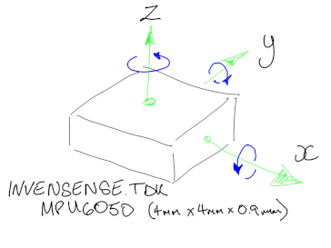
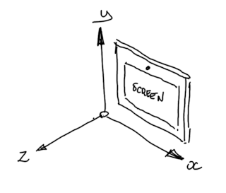

# How I got there

(Around the houses and up the garden path)

I took many wrong turns, wondering why nothing was happening when I tried altering values in the sensor matrix. Error number one was researching rotation matrices (this is about direction not rotation) and number two was not watching the indentation and spaces, **this is _extremely_ important**.

### Setup

The orientation data is generated by an accelerometer, i.e. a sensor which reports which way is up. The i2c sensor bus can accept 3 axis gyroscope, accelerometer and compass, though we are only interested in the accelerometer. This is handled by the iio-sensor-proxy.service and configured in `/usr/lib/udev/hwdb.d/60.sensor.hwdb`. Check this file to see if the device is listed. If not, this file contains helpful information on how to go about customising with a configuration file at `/etc/udev/hwdb.d/61-sensor.hwdb`. This file will append the system file (it is read after it at the initialisation of the hardware database) and will persist after any system updates.

### Identifying the tablet and sensor

On the back of the case of my tablet it states "*Toshiba WT10a 102*". To find the full DMI string  or modalias of the device use `cat /sys/class/dmi/id/modalias`. This returns:
```
dmi:bvnToshiba:bvr2.00:bd01/09/2015:br2.0:efr19.0:svnTOSHIBA:pnTOSHIBAWT10-A-102:pvrPDWOBE-00800TEN:rvnType2-BoardManufacturer:rnType2-BoardProductNAme:rvrType2-BoardVersion:cvnChasisManufacturer:ct10:cvrChassisVersion:
```

To find the details for the sensor use `udevadm info -q path -n /dev/iio:device*`. This returns:
```
/devices/platform/80860F41:02/i2c-2/i2c-INVN6500:00/iio:device0
```

This can be used to find the device modalias in the sensor parent with ``cat /sys/`udevadm info -q path -n /dev/iio:device0`/../modalias``. This returns:
```
acpi:INVN6500:
```

The device label (if it exists) can be found in the label file of the sensor with ``cat /sys/`udevadm info -q path -n /dev/iio:device0`/label``. In my case this returns:
```
cat: 'sys/devices/platform/80860F41:02/i2c-2/i2c-INVN6500:00/iio:device0/label': No such file or directory
```
<!-- i'ts in github version not my local ones -->

### The hwdb.d file

It's useful to see if there is an existing similar configuration in the hwdb.d file so `cat /usr/lib/udev/hwdb.d/60-sensor.hwdb | grep -i -A1 'toshiba'`. This returns:
```
# Toshiba
#########################################
--
# Toshiba Encore WT10A tablet
sensor:modalalias:acpi:INV6500*:dmi:*:svnTOSHIBA:pnTOSHIBAWT10-A-103:*
 ACCEL_MOUNT_MATRIX=0, -1, 0; -1, 0, 0; 0, 0, 1
```

Where the format is:

```sensor:modalias:<parent modalias pattern>:dmi:<dmi pattern>
or 
sensor:<label>:modalias:<parent modalias pattern>:dmi:<dmi pattern>```

Here the match is made against `acpi:INV6500*`(sensor parent modalias plus wildcard) and `:svnTOSHIBA:pnTOSHIBAWT10-A-103:`(dmi system vendor and product name surrounded by wildcards). The colons surrounding the vendor and product name appear superflous. The matrix describes swapping and inverting the x and y directions.

OK, so I was lucky and had a close match. A simple edit to the product name and update could possibly get me on my way. It would have done, however a typo (yes, one of those spaces) meant I could not solve this and so I went further into trying to figure out the matrices.

### Matrices

The orientation matrix is used to allow for the possible variations in mounting the accelerometer in the device. Possible values in the 3 x 3 matrix are 1, 0, and -1. For each axis of the accelerometer, a line in the matrix defines the mapping to an axis of the output. The first line of the matrix (first 3 numbers of the hwdb.d file) define whether data from the accelerometers x axis is assigned to the x, y, or z axis of output via 1 (select), 0 (ignore) or -1 (negated). Each line should have one and only one output.

|inputs from accelerometer||x|y|z|outputs from matrix|
|---|---|---|---|---|---|
||(*x*) :arrow_right:|*x out*|*y out*|*z out*|:arrow_right: output|
||(*y*) :arrow_right:|*x out*|*y out*|*z out*|:arrow_right: output|
||(*z*) :arrow_right:|*x out*|*y out*|*z out*|:arrow_right: output|

where
 
||x|y|z||
|---|---|---|---|---|
|*x in*|1|0|0|*x* out|
|*y in*|0|1|0|*y* out|
|*z in*|0|0|1|*z* out|

is the identity matrix i.e. no change. If *x* input is 1 *x* out equals 1 and so on.  
In the hwdb.d file this would be written as `1,0,0;0,1,0;0,0,1`

||x|y|z||
|---|---|---|---|---|
|*x in*|0|0|1|*z* out|
|*y in*|0|-1|0|*-y* out|
|*z in*|1|0|0|*x* out|

swaps *x* and *z* and negates the *y* value.  
In the hwdb.d file this would be written as `0,0,1;0,-1,0;1,0,0`

## Testing the tablet

A bit of searching on the internet and I worked out the chip was an MPU-6050 from InvenSense.TDK and even found the specs showing the axis.



Time to test using the diagnostics from https://gitlab.freedesktop.org/hadess/iio-sensor-proxy. `monitor-sensor` reports back some details of the sensor and then continues to report back it's output as you move the tablet device.

|tablet|expected|sensor reported|actual|display|
|---|---|---|---|---|
|top up|y=1|left up|x=-1||
|left up|x=-1|normal|y=1||
|bottom up|y=-1|right up|x=1||
|right up|x=1|bottom up|y=-1||

From this it can be seen that x and y need to be swapped and negated ie *x = -y* and *y=-x* and *z* has no bearing so can stay the same. This can be written as:

||x|y|z||
|---|---|---|---|---|
|*x* in|0|-1|0|*-y* out|
|*y* in|-1|0|0|*-x* out|
|*z* in|0|0|1|*z* out|

swaps and negates *x* and *y* leaves *z* unchanged.  
In the hwdb.d file this would be written as `0,-1,0;-1,0,0;0,0,1`

.....Which is exactly the same as the existing Toshiba entry in the hwdb.d. Doh!

## Creating the hwdb.d entry

It is recommended to add an entry in a file `/etc/udev/hwdb.d/61-sensor.hwdb` to append your rule to those already in `/user/lib/udev/hwdb.d/60-sensor.hwdb`. Be careful if copy - pasting to ensure there are spaces in all the right places and no more! `sudo nano /etc/udev/hwdb.d/60-sensor.hwdb` or `sudo gedit /etc/udev/hwdb.d/60-sensor.hwdb` and add the necessary lines such as:

```
#########################################
# Toshiba
#########################################

# Toshiba Encore WT10-A-102 tablet
sensor:modalalias:acpi:INV6500*:dmi:*svnTOSHIBA:pnTOSHIBAWT10-A-102*
 ACCEL_MOUNT_MATRIX=0, -1, 0; -1, 0, 0; 0, 0, 1
```

It is suggested to contribute to the systemd project on github by supplying your configuration. In that case a more general rule might apply to catch both the 102 and 103 tablets in the `/user/lib/udev/hwdb.d/60-sensor.hwdb` file as follows:

```
#########################################
# Toshiba
#########################################

# Toshiba Encore WT10-A type 102 and 103 tablets
sensor:modalalias:acpi:INV6500*:dmi:*svnTOSHIBA:pnTOSHIBAWT10-A-10*
 ACCEL_MOUNT_MATRIX=0, -1, 0; -1, 0, 0; 0, 0, 1
```

## Restart with new settings

For the changes to take effect the hardware database has to be updated and the sensor service restarted. This can be done with:

```
sudo systemd-hwdb update
sudo udevadm trigger -v -p DEVNAME=/dev/iio:device0
sudo systemctl restart iio-sensor-proxy.service
```

## Commands

`cat /sys/class/dmi/id/modalias` or
`cat /sys/devices/virtual/dmi/id/modalias` to see full dmi of tablet where

> bvn =   (BIOS vendor)  
  bvr =   (BIOS version)  
  bd  =   (BIOS date)  
  br  =   (BIOS release)  
  efr =   (EC firmware release)  
  svn =   (system vendor)  
  pn  =   (product name)  
  pvr =   (product version)  
  rvn =   (board vendor)  
  rn  =   (board name)  
  rvr =   (board version)  
  cvn =   (chassis vendor)  
  ct  =   (chassis type)  
  cvr =   (chassis version)  
  sku =   (product SKU)  
 
`cat /usr/lib/udev/hwdb.d/60-sensor.hwdb` to see the whole configuration file  
`cat /usr/lib/udev/hwdb.d/60-sensor.hwdb | grep -ignore-case --after-context=1 'toshiba'` to filter down to the tablet manufacturer plus one line of trailing context  
`udevadm info --query all --name /dev/iio:device*` finds the sensor in this case kernel device node name 'device0' on 'INVN6500'  
`udevadm info --export-db` to verify the sensor is detected, returns the platform, name and more for all udev devices  
`udevadm info --export-db | grep iio` to filter down to the sensor  
``cat /sys/`udevadm info --query path --name /dev/iio:device*`/../modalias`` return the sensor parent modalias  
``cat /sys/`udevadm info --query path --name /dev/iio:device*`/label`` return the sensor label (if exists)  
`gdbus introspect --system --dest net.hadess.SensorProxy --object-path /net/hadess/SensorProxy` check whether a sensor is detected  
`monitor-sensor` to check the sensors output  
`sudo dmesg | grep --ignore-case toshiba`  diagnostic messages for the tablet manufacturer (reports "dmi: TOSHIBA TOSHIBA WT10-A-102/Type2")  
`sudo dmesg | grep --ignore-case invn6500` diagnostic messages for the sensor (reports the sensor was using identity matrix ie. no change)  
`sudo systemd-hwdb update`  update the system with any changes made to configuration  
`sudo udevadm trigger --verbose --property-match DEVNAME=/dev/iio:device0`  update the system with any changes made to configuration  
`sudo systemctl restart iio-sensor-proxy.service` restart the service to see the effects of any changes made to configuration

## Useful websites

1. https://gitlab.freedesktop.org/hadess/iio-sensor-proxy
2. https://git.kernel.org/pub/scm/linux/kernel/git/torvalds/linux.git/tree/drivers/firmware/dmi-id.c
3. https://github.com/systemd/systemd
4. https://www.freedesktop.org/software/systemd/man/hwdb.html
5. https://git.kernel.org/cgit/linux/kernel/git/torvalds/linux.git/commit/?id=dfc57732ad38f93ae6232a3b4e64fd077383a0f1
6. https://people.skolelinux.org/pere/blog/Modalias_strings___a_practical_way_to_map__stuff__to_hardware.html
